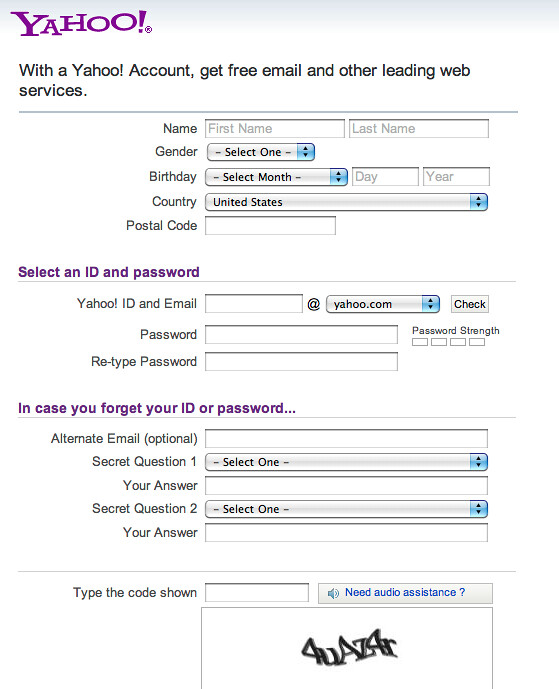
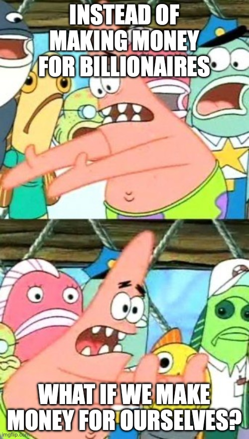

+++
title = "\"Back to base-ics\""
date = "2025-08-15"
updated = "2025-08-15"
+++

#### from the desk of [planetnineisaspaceship][planetnine]

# No one ever wanted a three-headed hammer

When I was a kid I got glasses, and since grown ups always like to try connecting to kids through cultural cliches, I heard the old saw more than once, "Do you know when glasses were invented?"
"When somebody needed them."
Necessity _is_ the mother of invention after all.

I like thinking about when things were invented though. 
Like glasses probably benefited a bit from Newton's work in Optics. 
There's the story of Benjamin Franklin inventing bifocals so he could watch French-speaking lips better.
Whether his need there was for diplomacy, or to settle bills with his companions accurately is lost to the, er, annals.

Way back in high school I got into set construction.
I've always loved building stuff, and it definitely scratched the itch. 
It culminated in this masterpiece:

This bad boy was twenty feet long and twelve feet high, and only broke two light fixtures in the Student Union. 

Building stuff out of wood is somewhat more accessible than programming, though it is certainly nuanced and complex in its own right, so I'm going to use it as a metaphor here.
Specifically we're going to talk about tools. 
Tools have a mother to their invention, but more importantly they're named after what they do, and we forget how beautiful a thing that is.

## Typing class

In programming every thing is a construct.
It might be a construct at different layers in the programming stack, but it's all a construct nonetheless because you and I don't speak in voltages, and that's all the machine "understands."[^1]

One such construct is called a type.
You assign a type to a thing, and that tells all the software running to try and prevent you from making mistakes what that thing is and what you can do with it. 
For example, a DOG type might allow a BARK, but not a MEOW.

In general, the more restrictive the type is, the easier it is to work with, and the less useful it is for mapping things to the real world. 
A classic example of this is how to model names. 
You might be, "oh easy! FIRST NAME and LAST NAME."
Great. 

But what about junior, or the third?
What about multi-part names like Mary Jo or long last name?
What about Prince, Cher, Madonna, and Bono?

I don't want to bore you with why all of this matters, but I'll expand a bit in a footnote for anyone curious.[^2]

Pretty much all programmers like types because other programmers can write programs to check your types and spare you the embarassment of having a bug in your code when you submit it for review.
This is all well and good in the business world where the stuff you code is for specific use cases where the types you have more or less cover contrived business needs in the first place, but the benefit to programmers undermines the more interesting ontological question of what things are.
Or maybe more perniciously, it imbues to the type the notion that it _is_ what the thing _is_, and is not the facsimile of what the thing _is_ that it _is_.

What is a name after all? 
One could imagine an afternoon at the bar, debating the concept, and never reaching a satisfying conclusion.
If you want to make something, you have to define it somehow. 

Now there is a pretty significant cost to this seemingly simple piece of information, which is that users hate having to fill out forms, and having to figure out how to fill them out is even worse. 
If you, like me, have ever wondered why you have to fill out these stupid forms all the time, it's because people, like me, can't agree on what things are.
Like a lot of things, you can trace this argument back to ancient philosophers, and at least a few of them were as good as modern day data "architects." 

This whole user experience, called onboarding in the biz, is one of the largest, and arguably most important part of the customer acquisition funnel. 
Make it _too_ annoying, and people bounce off and leave, make it too easy and you don't gather enough information from them to incessently spam them with advertising. 

This has an interesting side effect on software products over time. 
The product is built out behind the onboarding, adding feature upon feature without that necessarily being the best thing. 
Ostensibly this makes you "competitive," but at what cost?

## Drills and sewing kits

Super gigachad programmers like me use a little program called vi to write code. 
It came out in 1976, and hasn't changed much from that year. 
It is, for me, the most useful tool that I "own," and it asks nothing of me. 
It doesn't know my name, it doesn't know my email, it just sits there waiting to help me achieve my dreams. 

This is how machines should work.

Back a decade and a half ago or so, I got rid of most everything I owned, and moved across the country. 
Three platic bins were all I took with me.
Most of that was clothes, and electronics, but I brought two tools with me: a drill, and a sewing kit.

I've gotten more utility out of those two items than most anything else I've owned. 
To be fair, I use the drill more than the sewing kit now that I can afford furniture and clothes, but for my twenties I could not so the drill put together cheapo tables and shelving, and the sewing kit kept my two pairs of trousers going. 

Here's the thing.
I don't really know how to "use" the drill, and I don't really know how to "sew."
For that matter, I'm sure there are people who would say I don't know how to "program" either.

But I am not in the business of impressing people with my sewing, programming, and, in most contexts, drilling ability.
I'm in the business of getting things done, and for that I use the tools as I can, not necessarily as they were meant to be used.

This bad boy is a 3.3 million year old hammerstone. [Carrier bags may have come first,][carrier-bag] but not by much I'd imagine. 

3.3 million years ago, long before humans arrived on the scene, some hominins got the bright idea to start hitting things with flat rocks. 
Somewhere between then and 600 years ago or so, someone tied the rocks to a stick, and the hammering really started. 
Then 600 years ago, someone added the claw, and the modern hammer was born.

Three "product innovations" in 3.3 million years.
Do you have a hammer in your home?
I'll bet you dollars to donuts it has a hammerin' side and a pryin' side, and that's it.

Because no one, in 3.3 million years, has ever wanted a three-headed hammer.

## The legislature problem

If you put a bunch of people in a room and tell them their job is to make laws, they will, despite their best efforts not to, make laws.
Whether the laws are necessary or not is immaterial because the job is to make laws, not decide on whether or not laws get made. 
If there's no way to give this group of people something else to do, they'll just keep making laws. 

I call this the legislature problem. 

In software, it's not uncommon to have a product team, or a feature development team, and that team's job is to work on the product. 
Most of the time this means churning out features regardless of whether or not the features are needed. 

There are many problems with this approach, and the ones I have to deal with at work aren't worth talking about.
What is worth talking about is how, over time, pretty much all software becomes unusable garbage. 
And when I say unusable, I don't mean people can't use what they already know how to use, I mean people just give up on trying all the new "features" that companies are adding. 

The last twenty years or so have given us a very skewed idea of what success for a product looks like. 
There's never before been a globally available distribution system for that's consistent for the number of users who now have smartphones that can access the internet. 
Facebook claims two billion monthly active users.

How many do you think hammers have?

Meta has tens of thousands of employees. 
Their product is selling your eyeballs to advertisers. 
So the "features" they're working on are ones that get you to spend _more_ time in Facebook. 

Nothing to really do about that, Meta can do what they want even if it's horrible so long as it doesn't break too many of the laws that actual legislatures churn out at around the pace of Facebook releases.
The problem is that they've convinced a bunch of visionary CEOs that this is how software is to be made.
So now when you go to write a grocery list you have to wait for your phone to sync, and have different header font weights, and three dots, and hamburger buttons, and fabs, and uuuugggghhhh.

I've deployed a fair number of apps, and every single one of them was meant to help humans complete a task that was necessary for what they needed or wanted to do--that is, they were tools and not media.
Every single one had people who wanted us to find ways to keep people in the app.

You know what you call a hammer that makes you hammer longer than you need to be hammering?

A bad hammer.

But if your hammer development team is just employed forever to add things to your hammer, they're gonna add that third head even if no one wants or needs it.
The thing that keeps that from happening is that other people make hammers, and it's real easy to make a hammer that's better than a three-headed hammer.

So what's the two-headed hammer for Facebook?

## Content is king

A hammer is a tool, tools want to get the job done as quickly as possible. 
Social media (heretofor referred to as SoMa) isn't a tool to do tasks. 
It is a way to fill idle time, so figuring out how to compete with it isn't as straight forward as just doing it "better."

But if we consider use cases where time is limited, we can think of some metric.
More or less all SoMa platforms are divided into three types of posts: posts you've elected to see (P), posts the platform presents to you to try and keep you engaged (E), and advertising (🤮). 
The goal being to have P provide enough dopamine hits that you suffer through E and 🤮. 

Presumably if you provided a platform with just P and E, folks would use that.
That's the notion behind BlueSky, and to a lesser extent the apps of the Fediverse, and I'd say thus far results have been mixed. 
These platforms give more control to users, but users don't really seem to want that. 

They just want the dopamine hit. 

So... what if we do that?

Did you know that if you make content you own it forever regardless of whether you post it to social media or not? 
If you make a reel, you can post that to tiktok too.
Make that easy enough, and provide the people a way to get paid and you'll get the content so long as there're viewers.
And there'll be viewers so long as you give them the right tool.

I don't want to have to assemble my hammer.
I don't want to have it handed to me in some giant kit of optional attachments and doodads. 
I don't want to hear about servers and firehoses and frames and self-sovereign whatever, and I sure as hell don't want to hear the word blockchain. 

I just want the hit man, scrolling words/pics/vids tapped into my brain to help me forget the hour long meeting I was just in about the problems of user-curated location discovery. 

Just give me a hammer that hammers.

You get the content in a place without ads that just works, and I'm there.

## These whippersnappers these days

The youts want to be influencers. 
I can't blame them, if you got your phone from your parents, that's basically no startup cost you know?
Mooching off your parents worked for Bezos, Trump, Zuck, Musk, Page and Brin, might as well help the youts too.

Some of my grumpy friends think this move to SoMa content creation is quite the end of civilization, but I'm like really mister played in bands until you were thirty-five?
I wanted to be a writer when I was a kid. 
A lot of my friends wanted to make movies. 
And I still know plenty of people who would happily make art for a living if they could.

We've all wanted to be creators at one point or another, or at the very least make money doing something we enjoyed. 
The problem with doing that is the same as it has always been, which is that it is very difficult to make a living creating things. 
SoMa, like all creative outlets before it, suffers from massive survivorship bias.
For every Mr. Beast, Pokimane, and Kardashian, there are thousands, nay millions of less _wealthy_ influencers.

But are they less successful?

Ah success. 
Fewer constructs of humanity writhe like a pile of slimey larva poised to slip through one's grasp lest one hang onto them long enough for them to bite you. 
Poor man want to be rich, rich man want to be king, and a king's not satisfied 'til he owns everything.

We were fed the dumbest lie growing up, find what you love, and you'll never work a day in your life.
I've got a toddler who's into Dragonforce, brunch, and happy halloween things. 
He's more fun than most adults, and I love him dearly, but it's still work.

Everything less fun than hanging with him, which is everything, and is especially whatever job I happen to have, is you-got-to-pay-me work.
Writing though, that I will do on my own time, and in my own way, just for funsies. 
I'm doing it right now in fact. 

When I (self-)published my first book I told myself it would be a success if I sold more than one copy. 
I sold...twelve. 
That is One Thousand Two Hundred percent more successful than I expected. 

To put this into perspective, if the sun were twelve-hundred times[^1] more massive than it is Claude posits this would be our solar system: 

> This wouldn't just kill everything in our solar system - it would prevent any life from ever forming in the first place. The star would be so energetic and short-lived that planets wouldn't have time to cool, develop atmospheres, or support any chemistry necessary for life.

If you ever need a little pick me up, just try to think of what would happen if a star did something X many times as you did.

You know it's been a while for me, but I do remember a bit of what it was like to be young. 
My "influencing" was done with my band. 
We weren't serious, but we were known for helping everyone get drunk, and for our efforts several venues paid us in free drinks and even a bit of the rake on the night just for bringing in the lushes. 

We even had merch, which was almost as much fun as the music. 
Every album we put out was a discography, because that's both awesome and hilarious. 
We made shirts of course, but the real gem was when our guitarist Tim went down to the corner store, picked up five white shower curtains, and drew our logo on them. 
Those sold out immediately. 

We never made a ton of money, but we did usually make enough for a cube of Oldstyle at our next practice.
You know what's pretty awesome?
Paying for beer with money you made playing music for beer. 

That, my friends, is success. 

## Five bucks

I've been making things for as long as I can remember.
I remember being sat down at a typewriter in first or second grade because I just wanted to write stories. 
Now I'm in my fourties, and there are two things I've learned:

* No matter how good your thing is, people will tell you it sucks.

* No matter what you're trying to do, people will tell you you're going to fail.

One of the biggest bands on Earth's singer played their first recording at a party at my parent's house right after leaving the studio. 
We all told him it was too poppy lol. 
It was, for us. 
I never bought one of their albums, but millions of other people did. 

The Land of Whiskey didn't have the same broad appeal, but it did make enough money for a bit of its titular beverage, and was probably commensurate with my musical ability. 
And if that's the band you were, are, or are going to be in then you're my people.

If like me, you're not buying that whiskey without the thirty bucks the Mutiny gives you for bringing in your drunk friends, you're even more my people.

And it's for you that I'd like to hand you a hammer.

The point of the hammer is to bash through the walled gardens of tech gigantocorps, and pry five bucks from them.
If you're my people, you can use five bucks.
If you can't, feel free to give it to someone else. 

Your hammer's going to work because it's only got two heads.
The gigantocorps have hammers so overladen with nonsense they've lost their rigidity, and just consume by tendril all that is good in this world like the pollution that consumes the gods in Princess Monanoke. 

All you have to do are the things you would be doing if you weren't doing the things you have to be doing. 
The hammer will do the rest. 

[planetnine]: https://github.com/planet-nine-app/planet-nine

[^1]: Now that AI is around, I find it necessary to constantly and incessantly remind people that computers are not sentient. They may become so, and it might be the case that saying they are not now is bad, but they aren't sentient as of this writing. 
[^2]: Let's say you want to do something like give everyone with a last name starting with the letter B a dollar. That is pretty easy to do if you have a separate LAST NAME field. On the other hand, on the client side it's much easier to just have a single NAME field and let people enter what they want. If your system is going to be supporting many inputs of names from different places, flexibility reigns. 
[^3]: The mathematically inclined reader will notice that there is quite a difference between 1200% and 1200 times more. The literarily inclined reader will note I never said they were equivalent. When understanding a construct, use whatever methods are at your disposal. 
