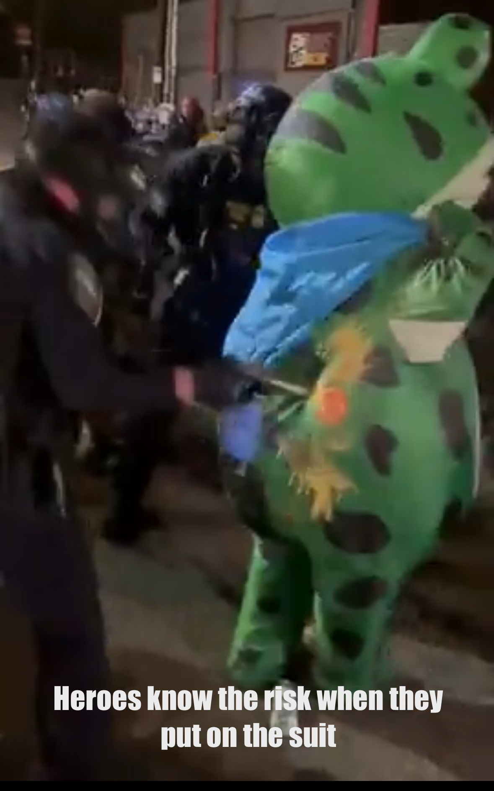
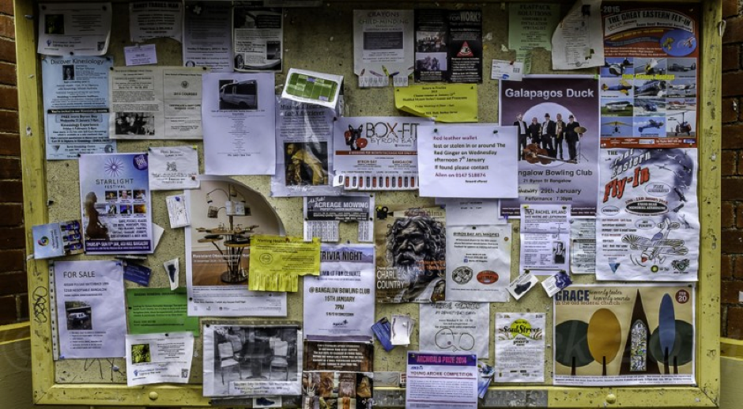
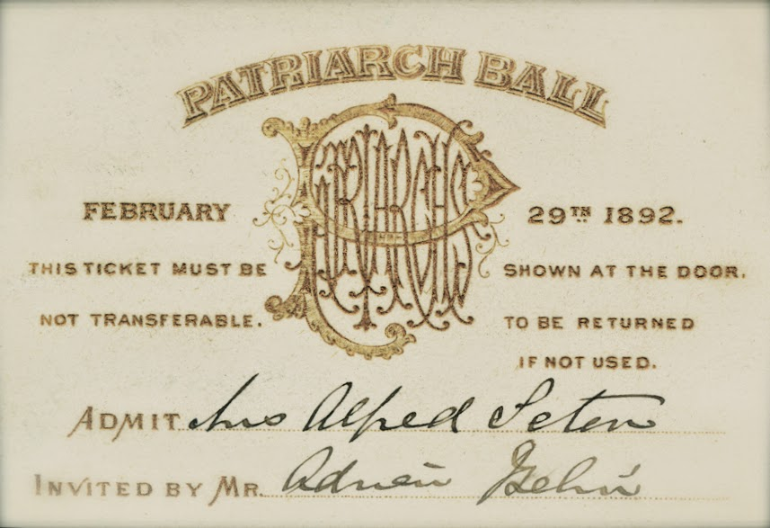
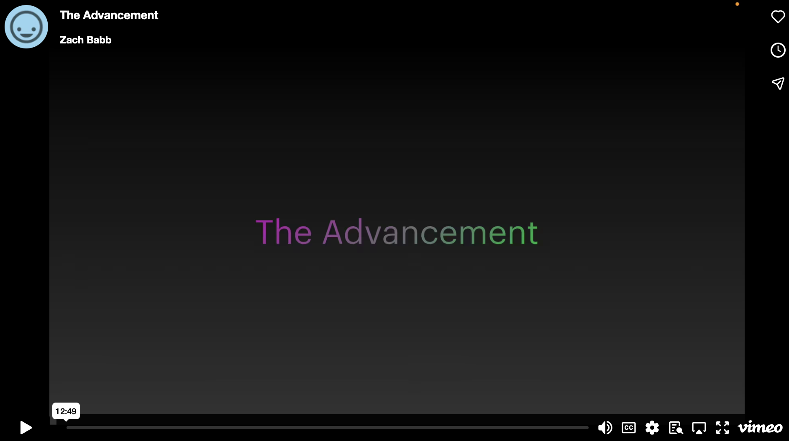

+++
title = "The Advancement"
date = "2025-10-11"
updated = "2025-10-11"
+++

#### from the desk of [planetnineisaspaceship][planetnine]

# The Advancement

[Now live in beta. Grab the apps here.][the-advancement]

I have a toddler. 
He goes to a school with other toddlers, and if you've never seen groups of toddlers you'd probably be surprised at how casually violent they are.
But what's even scarier is that they're like naturals at it.

Another group of toddlers were having problems throwing, and I was reminded of how I read that the human throwing motion was the fastest terrestrial motion.
Cheetahs might run faster, but no animal out there throws like we do with both speed and accuracy. 
A few hominids with pointy sticks are the apex predators of this world, and it's been that way since long before us sapiens sapiens burst on the scene. 

The researchers who put together this study of the history of throwing suggested it evolved two to four million years ago. 
Then, ten thousand years ago or so, all over the world our ancestors decided to hang up the sticks, and put down roots--literally--with agriculture. 
This, considering it has led to the proliferation of many more of us, is considered an advancement. 

Now don't get me wrong, farming is very cool, and I'm glad it's around, but watching my little guy chuck things around his world with a smile on his face like he's just acquired an infinity stone, I have to wonder, why did we stop throwing?

## To the bar

In my decades of trying to solve the world's problems with a pint from a bar stool, I would, on occasion, lament the loss of what I can only imagine were truly delicious animals. 
Mammoths, dodos, carrier pigeons, I mean it's kind of a long list of animals that have gone extinct right around when humans show up. 
Have you ever had bison?
It's delicious, and we almost hunted them to extinction because they're delicious.

When I bring this up, I'm usually met with incredulous looks, as though the disappearance of North American megafauna once the clovis people crossed over from Kamchatka is some head-scratching mystery. 
I'll tell you what happened.
Some toddlers grew up, and threw some pointy sticks, and couldn't stop themselves because giant ground sloths were apparently quite delicious.

You know what's not delicious?
Gruel...

> Einkorn was a staple food source for some of the earliest civilizations. Used to make flatbreads, porridges, and gruels, it provided sustenance and nourishment to ancient peoples.

[I was going to put a picture of gruel here, but tbh if you're not really hungry it's a bit much to just see. Use your imagination if you'd like lol]

Now it's possible that we figured out how to make the gruel into a potent potable which enhanced probably the one thing we do better than throw: socialize.
But I don't know, put some fermenting baskets on a sled and drag that with you if you need to. 
I'm no archaeologist though so let's just take these two things as a base.

Getting food, and making friends, those seem like two pretty good reasons to advance. 

## How much does bread cost?

If you're French, you have the good sense to overthrow your government at least once a generation.
All the rest of us have to wait for something to spur us to action, and because not much has really changed in our biology in the last 10k years, that mostly has to do with the price of bread.
When bread gets too expensive, the government's got to go. 

Usually when we have to do that we revert back to what we know: the throwing of pointy sticks, and look we all know we've got to keep pointy sticks around because there're people who never grew up from that toddler phase who think that pointy sticks are the only language worth speaking.
But most of us realize that in this modern world we should be able to make bread affordable without resorting to pointy sticks. 

The Mongol Khans from Ghengis to Kublai killed enough of humanity to alter the climate of the Earth (probably), but when Marco Polo showed up in front of Kublai in China they were cool. 

The only thing we do better than throwing pointy sticks is socializing.
And when you're going to socialize with a murderous Khan in a foreign land, there's only one way to do it really. 
You bring something he's gonna like, and trade it with him. 

## The Friendship Revolution

As I type this, the streets of my city are being invaded by troops who share my citizenship at the behest of a would-be dictator. 
Our greatest champion arrived mere days ago.
It's this guy:

For a while now I've been telling my friends that there's room for everyone in The Revolution. 
Here's the definition of revolution:

1. a forcible overthrow of a government or social order, in favour of a new system.
2. (in Marxism) the class struggle which is expected to lead to political change and the triumph of communism.
3. a dramatic and wide-reaching change in conditions, attitudes, or operation.

See when I say The Revolution, I'm talking about 2 there, but most people hear 1. 
I have not had much luck recruiting people to forcibly overthrow much of anything. 

Now let's look at the definition of advancement:

1. ~the process of promoting a cause or plan.~
2. ~the promotion of a person in rank or status.~
3. a development or improvement.

So I've got two options: get everyone to read, understand, and agree with Marx; or maybe change my terminology.

## What needs improving?

There are more computers than people on Earth, and most of them that are used by humans are smartphones. 
Smartphones are different from desktops in one big way: you don't typically share your phone with other people.
The whole email/password thing that's everywhere was built for shared machines. 
Could there be something different we could do here that wouldn't be so annoying?

I've written [a lot][identity] about [identity][smart-cities] and recently that's come back to a question about trust. 
As usual, there's [a relevant xkcd].

But I've realized that explaining how things technically work is both boring, and not all that useful. 
So instead I'd like to tell a story.
I've been hanging out with these cool musicians building a platform for musicians that doesn't suck called [mirlo][mirlo], and that's got me reminiscing about my days as a yout hanging around record shops and venues in the suburbs of Chicago.

This new record store opened up in Evanston, I think it was called Raw Records, and this guy whats-his-bucket worked there. 
We all thought whats-his-bucket was super cool because he was twenty-two and worked at a record store. 
Then he started hitting on the high school girls, and he lost some cred. 

Whether to regain some raport or simply because he could, whats-his-bucket ruled Raw Records with an iron fist.
To be welcome there you had to earn his trust. 
Only two ways to do that: show up, talk records (the right way) for a few hours a few times, and spend some money; or have someone vouch for you. 

In their fervor to get everyone in their record store, the gigantocorps forgot what you needed to be cool. 
Not a big deal, maybe, unless everyone forgets to be creeped out when they start hitting on the high school girls. 
Or, you know, [supporting genocides][meta].

Now I'm not saying we need a bunch of whats-his-buckets gatekeeping the internet, but there's something to a group that you at the very least need a bit more than an email to be a part of.
At the same time, whats-his-bucket wasn't blocking the entrance to the store. 
So what on Earth were we after by trying to get in his good graces?

I had forgotten, because it has been so long, until someone on the mirlo discord talked about tickets. 
Album drops were important, but for what we listened to it was uncommon that anything sold out, but the way tickets worked for smaller venues way back in that day was more or less consignment.
They'd give some record store fifty tickets to sell, and once those were gone that was it. 
If you wanted a tic to something that was gonna sell out, you needed to know when the store was getting those tix, and that meant knowing ol' whats-his-bucket.  

I've written [elsewhere][yelp] about the garbage that search has become, but here's another look:

Here's the top link from a google search for indie concerts in Portland. 
Ad-infested garbage. 
Above the fold there aren't even any concerts. 
Scroll down, more ads, it's so bad it looks like Friday doesn't even have concerts. 

So then I went through songkick's onboarding to see what'd take to post a concert, and it's just...
Seven screens, and a bunch of not useful stuff later, I have a sidebar full of options I don't need and a form to fill out.
This isn't songkick's problem, it's the problem of the whole way the internet is set up. 

So then I got thinking, how did we know about those upcoming concerts back in the day?
Well if you had a show coming up, you'd head on down to kinko's, print fifty flyers, and hang them around town. 
That may or may not be how we would find out, but how we would definitely find out is through the people who had those fifty flyer locations known and regularly checked them for updates.
Those people were usually the ones who had stores that sold tickets. 

Who's going to Galapagos Duck with me?!

And there you go, record store owners providing a service to the community to get us into their stores to buy the records we were gonna by anyways. 
I don't know if that's how things _should_ work, but it sounds a whole lot better than the bullshit that happens now.

But of course this model doesn't really work when someone's got to find your flyer hidden within the whole world's collective digital production. 
And it takes a while to build a store large enough for everyone on Earth. 
So, let's see if we can do something else to let people be cool again.

## Where are your friends?

I've been watching a lot of period dramas as forty year old men do these days, and as someone who is interested in identity, I feel the fancy ball works as a perfect metaphor for how this stuff works. 

Let's say Carrie Coon and train daddy from Gilded Age decide to hold a ball. 
They send out invitations to everyone they want to come to the ball.
These are your account credentials, and since who you are is important, they announce that you're the "Grand Duchess of Esterberry, Margarita Vendroboth" (yes I'm mixing US new money with British aristocracy, just roll with it). 

The original email and password. I hear they used to call it just "mail."

Now let's say that in addition to your title and your name, they also announced your net worth, "Grand Duchess of Esterberry Margarita Vendroboth worth ten million ducats!"

Now let's say someone else throws a masquerade ball, and to keep everyone's anonymity so they can do depraved rich people things with impunity, they only announce the net worth, "ten million ducats!" 
This is how blockchain works. 

Now let's say someone else throws a ball, and they say you can announce yourself however you'd like, but you have to use some combination of title, name, and net worth. 
Something like, "Grand Duchess of Esterberry with ten million ducats!"
That's self-sovereign identity.

Imagine if you will two ebullient youths, love-stricken like Romeo and Juliet before them, but wise enough to keep their distance a prudent space.
They develop a shared language of smiles, fluttering eyelids, and lingering glances. 
The hosts can see it of course, but so long as nothing crosses invisible lines, it is allowed.

At the three balls the youths can be whatever combo of properties they want, but they'll always find each other. 
Not because smiles, and flutters, and glances are unique, but because they're shared. 
Spies call these your "bona fides", and my favorite recent example is from the show Andor. 

Mon Mothma, beset as the empire realizes her connections to the rebellion, is joined by Cassian Andor whom she has never met. 
She avoids him until he uses the passphrase that Luthien had told her, "I have friends everywhere." 
The use of the phrase changes the context around and between them.
He's no longer a threat, he's an ally, and now they can work together.

They have identified themselves to each other via this passphrase, shared with them from a mutually trusted source. 
Like those youths they don't know whether they'll ever see each other again.
They don't know if they'll ever need to. 
But for that moment, in that context, they know they're together on their world.

Cassian is the titular character so of course he ended up being the one sent by Luthien, but he didn't have to be. 
The passphrase would have worked with any spy of The Rebellion. 
It's the community that makes the passphrase work. 

Now think back to those balls. 
What's to stop the Grand Duchess of whosit whatsit from handing her envelope to her sister, or an assassin?
The credential swap is a plot point in like every espionage story ever. 
But if you didn't know to say, "I have friends everywhere," is that what you would say?
Would those youths be all a tizzy at the eye flutter of some rando?

And now think about ol' whats-his-bucket at Raw Records.
Is he remembering every high schooler that someone says is cool? 
Does he know their name, address, birthdate, etc?
Or does he just remember the Slapstick patch on their backpack, and that suffices?

If you're interested in the computery explanation of this metaphor, open this disclosure.

  
Let's talk about auth

In machine-land we talk about auth, which is short for two things: authentication, and authorization. 
The former, which we call authn, is what identifies a user with a system.
The latter, which we call authz, is the criteria the system uses to determine whether the user can perform some action in the system.

I talk a lot more about [digital identity in other places][identity], for now let's just say that I'm not a big fan of tying everything you do to your email.
The web has made us believe we need to announce ourselves like a duchess before buying socks, but that's not true.
Just like in the real world, all you need is authz to perform a transaction.
Target doesn't make you sign in when you walk through their doors, why do you need to do that online?

The main reason is so that everyone can advertise to you, but there are some things you have to do online to keep things cool otherwise bots and criminal weirdos will mess things up. 
So you do what authz you need to to make that happen.

In the metaphor above, the invitation cards are authn, and the passphrase is authz. 

The purpose of The Advancement is to be an authz-based system to compete with the authn ones. 

The purpose of The Advancement is to be a passphrase system to compete with the invitation card ones. 

## Peace, Love, and Redistribution

I was walking through the park one day, and I saw someone had drawn the interior bars of a peace symbol in a heart.
I liked the symbolism, but it also reminded me of when we tattooed crossbones under a peace sign on my friend's leg because his hippie girlfriend dumped him, and he went back to listening to metal. 
Months of meandering and coding brought us to today, where I'm excited to show you my passphrase:

☮️💚🏴‍☠️ 

Peace, love, and redistribution. 

There are many cool things about using emoji as a passphrase, but the coolest I think is that it's text.
Just how Cassian could say, "I have friends everywhere," in any hallway on Coruscant and Mon Mothma would respond if she was in earshot, I can drop ☮️💚🏴<200d>☠️  anywhere that text is allowed, which is pretty much everywhere online.
The only missing piece was how to handle this text, and for that it's best I show you:

## Anyone need anything?

Eight years ago my mind was racing as I was thinking about this stuff, and I had to give a presentation at a work "retreat."
This thought that friendship is magic kept looping in my head, and I keep coming back to it. 
Bare with me as I explain.

Lots of science-lovin' folks like to say that the laws of Physics are deterministic, and thus everything is determined.
A recent popular example of this is the book Determined by Robert Sapolsky, a neuroendocrinology researcher, who argues this very point by focusing on Free Will being determined.
Thing is he argues the point, it's not proven. 

So let's consider the counter-point: that Free Will does exist.
Well for it to be Free it must not be determined.
If the physical laws of the Universe _are_ determined though, well what does that mean?

Let's use some other words that come up when talking about Physics, the Universe, and things that exist just doing their thing: natural and unnatural. 
Natural will be the determined.
Unnatural is everything else, like Free Will. 

We humans use our Free Will (if it exists) to affect the natural (determined) world around us. 
I figured there's probably a word for when something unnatural affects something natural...

**magic**: the use of means (such as charms or spells) believed to have supernatural power over natural forces

Super- or un-natural...eh, close enough.

The gesture of friendship I kept coming back to was the high-five. 
A simple exchange of respect and/or gratitude, mutually rewarding, costing ATP (whether adenosine-triphosphate or activity points is up to you). 

What's the high five online?

I have friends in Portland, but online I'm everywhere.

I want everyone to have friends everywhere. 

That's The Advancement. 

## How do I join the club?

I went to this small liberal arts college called Reed, and because it's small, and people care about it, we talk a lot about the youts, and how they don't know anything like we did (definitely couldn't have anything to do with us being 40+ and them being 18).
One of the things that has really changed is the way the youts create and form groups.

Back in the day if you wanted to join a club, you just showed up **and then you kept showing up until they gave you a job**.
I'll let Captain Ron explain how this works:

The internet has created a planet of humans who expect to sign up with an email, and just be given everything. 
We're not gonna undue that any time soon, so what we need to do is make a club with better benefits that people want to join and do work for. 

Which brings us back to the first section, and why we humans bother to do anything: getting food, and making friends.
Make those things easier, and people will do them.
That's not political, or socioeconomical, or technological, or philosophical, or theological, it's anthropological.

And if we had figured it out long ago, maybe we'd still be able to try those tasty ground sloths. 

But we didn't, and so now the price of bread's too high.
That's the second piece of The Advancement. 
We talked in [the last blog post][hammer] about the plan to compete with existing software and redistribute those funds.
Now we have friends to redistribute it to. 

Since we've done some definitions let me give you another:

1. a group of people living in the same place or having a particular characteristic in common.
2. a group of people living together and practising common ownership.
3. a particular area or place considered together with its inhabitants.
4. a body of nations or states unified by common interests.
5. the people of a district or country considered collectively, especially in the context of social values and responsibilities; society.
6. denoting a worker or resource designed to serve the people of a particular area.
7. the condition of sharing or having certain attitudes and interests in common.
8. a similarity or identity.
9. joint ownership or liability.
10. a group of interdependent plants or animals growing or living together in natural conditions or occupying a specified habitat.

There are a lot of ways that we've come together to make bread cheaper, and make more friends.
They've worked fairly well for us thus far. 
Maybe we should try some of these out online rather than all hanging out in the modern equivalent of opium dens. 

That list of definitions could probably go on.
They're the definitions of _community_. 

Bread and friends.
Let's see if we can do better than spoiled gruel this time.

[identity]: https://opensource-force.github.io/osf-blog/posts/you-are-not-a-number/
[smart-cities]: https://static1.squarespace.com/static/5bede41d365f02ab5120b40f/t/65d305f9682e3158ed9386cf/1708328441775/ACM+Identity+Paper.pdf
[meta]: https://www.amnesty.org/en/latest/news/2025/02/meta-new-policy-changes/
[mirlo]: https://mirlo.space
[yelp]: https://opensource-force.github.io/osf-blog/posts/wheres-your-band/ 
[hammer]: https://opensource-force.github.io/osf-blog/posts/no-one-ever-wanted-a-three-headed-hammer/
[the-advancement]: https://the-advancement.com
